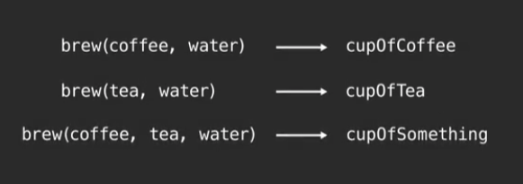
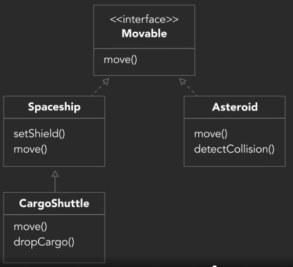
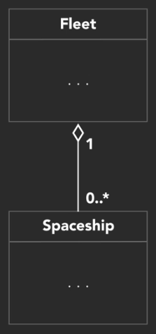

## INDEX

- [INDEX](#index)
- [Object-oriented thinking](#object-oriented-thinking)
  - [Advantages of OOP](#advantages-of-oop)
  - [Class](#class)
- [fundamental ideas in object-oriented programming (A-P-I-E. A pie!)](#fundamental-ideas-in-object-oriented-programming-a-p-i-e-a-pie)
  - [UML](#uml)
- [Analysis and Design](#analysis-and-design)
- [Use Cases and User Stories](#use-cases-and-user-stories)
  - [Use Cases](#use-cases)
  - [user story](#user-story)
- [Instantiating classes](#instantiating-classes)
- [Static attributes and methods](#static-attributes-and-methods)
- [Inerhitance and Composition](#inerhitance-and-composition)
  - [Identifying inheritance situations](#identifying-inheritance-situations)
  - [Using Inheritance](#using-inheritance)
- [Interfaces](#interfaces)
- [Aggregation](#aggregation)
- [Composition](#composition)
- [General development principles](#general-development-principles)
- [testing](#testing)

---

## Object-oriented thinking

- In **procedural** code, the program is written as a long series of operations (steps) to execute.
- in an object oriented manner rather than describing a sequence of steps, I'll describe each of the objects and what each one can do. So, instead of writing a single large program, my object oriented code is split apart into **several self contained objects**. Almost like several mini programs where each object contains its own **data** and **logic** to describe how it behaves and interacts with other objects.

- `Identity`, `attributes`, and `behaviors`. Those are the three things that describe objects in an object-oriented programming language. Every object in a computer program is self-contained so it has its own identity separate from other objects, its own attributes to describe its current state and its own behaviors, the things it can do.
- to figure out if something should be an object >>
  - just ask yourself, is it a noun?
  - could you put the word **the** in front of it?

---

### Advantages of OOP

1. code re-usability
2. useful in large-scale applications

### Class

code-template for creating program objects

- class components : name(type), attributes(properties/data), behaviors(operations)
- creating opject from class >> **Instantiation**

---

## fundamental ideas in object-oriented programming (A-P-I-E. A pie!)

1. Abstraction
   - it focus on central quality of somethins rather than specific example, ex : [person], used when defining a **class**
2. Polymorphism
   - it means having many forms
   - one form, called dynamic or run-time polymorphism, allows us to access methods using the same interface on different types of objects that may implement those methods in different ways.(`same method name but with different steps`)
   - **Method OverRiding**: inherit all of the attributes and methods from my class. But then, it replaces a method it inherited from the class that allows the object to redefine its own unique version of the method.
   - **Method OverLoading**: allows you to implement multiple methods within a class that have the same name, but a different set of input parameters.

     
3. Inheritance
   - inherit the attributes and methods of existing classes
   - **superclass**: parent class, **subclass**: child class
4. Encapsulation
   - containing the elements of an object. Not just to keep them together, but to also protect them from accessing from outside the class and if they want to access something, they will have to use my methods (black box)
   - why would you want to hide your own code? Why keep secrets from yourself? - It's not about being secretive. It's about reducing dependencies between different parts of the application. **The change in one place won't cause a domino effect** and require multiple changes elsewhere.

### UML

is not a programming language. It's a graphical notation for drawing diagrams to visualize object oriented systems.

---

## Analysis and Design

5 step process of analysis and design (`FIRBS`) to find out **what** we need to do and **how** we are going to do it.

1. Gather requirements

- Functional Requirements: we use the phrase "The system **must**
- Non-Functional Requirements: Describe required characteristics of the application rather than features, so we can use the phrase "The system **should be**..."

2. Describe the application
3. Identify the main objects
4. Describe the interactions
5. Create a class diagram

---

## Use Cases and User Stories

### Use Cases

A use case has 3 essential things:

- Title: **What** is the goal?
- Primary Actor: **Who** desires it?
- Success Scenario: **How** is it accomplished?

### user story

generally follows the pattern: "As a (type of user) I want (goal) so that (reason)"

---

## Instantiating classes

```Java
// Java
Spaceship myShip = new Spaceship()
```

```C++
// C++
Spaceship *myShip = new Spaceship()
```

```Ruby
# Ruby
myShip = Spaceship.new
```

```Python
# Python
myShip = Spaceship()
```

```Swift
// Swift
let myShip: Spaceship = Spaceship()
```

- When we instantiate a class, the properties are set at the start. We may have default values given to it, but if we try to use them without realizing we didn't set them it can lead to undesired behavior. We want an instance of our class to be in a meaningful state to begin with. For that we can use a **constructor**: _a special method that gets called to create an object_.
- **destructor**: _is a method that gets called when an object is no longer needed and is being disposed of._
- Languages that use garbage collection use something called a **finalizer**, rather than a destructor, but the concept is the same.

---

## Static attributes and methods

- **static variable**: is shared across all objects in a class. Also called a shared variable or a class variable.but it isn't a global variable

---

## Inerhitance and Composition

### Identifying inheritance situations

> **_Inheritance Describes an "Is a" Relationship_**

### Using Inheritance

Recognizing inheritance in code:

```Java
// Java
public class CargoShuttle extends Spaceship {
```

```C#
// C#
public class CargoShuttle : Spaceship {
```

```C++
// C++
class CargoShuttle : public Spaceship {
```

```Swift
// Swift
class CargoShuttle : Spaceship {
```

```Python
# Python
class CargoShuttle(Spaceship):
```

```Ruby
# Ruby
class CargoShuttle(Spaceship):
```

---

## Interfaces

An **interface** is a list of methods for a class to implement. It doesn't contain any actual behavior.

Interfaces and Abstract classes can seem similar at first, but they are different.

> Interfaces represent a **capability**

> Abstract classes represent a **type**

e.g. A CargoShuttle **is a** Spaceship

The Spaceship and Asteroid both might have a `move` method, but the only thing they have in common is the `Movable` interface. It wouldn't make sense for the Asteroid to inherit from Spaceship because it isn't a _type_ of Spaceship. However, moving is a _capability_ that they both share



---

## Aggregation

Another type of relationship (like inheritance) in which one object is built of other objects.

For example, a fleet is an object that contains a bunch of individual spaceship objects.

Aggregation is referred to as a **has a** relationship, opposed to **is a**.

> ~~A Fleet is a Spaceship~~

> A Fleet **has a** Spaceship



---

## Composition

A more specific form of aggregation, composition is based on a **has a** relationship, but it specifically implies _ownership_

We might say "A Spaceship has an Engine", but more accurately we would say

> A Spaceship **owns an** Engine

We imply ownership because an Engine has no meaning or purpose without a Spaceship. For example, if our Spaceship is destroyed by an Asteroid, then the Engine (and other contained objects) is destroyed too.

Aggregation isn't always necessary to show in a UML diagram, but composition is a more important relationship to show. It is represented by a _filled in_ diamond.

---

## General development principles

`DRY`:

**Don't Repeat Yourself**

&nbsp;

`YAGNI`:

**You Ain't Gonna Need It**

A common trap of new, overzealous programmers make is trying to make their code too extensible and trying to foresee every single possible scenario we may need to account for. However, this also means more debugging, testing, and code bloat. We don't want to waste time on things that will never be used.

&nbsp;

Code Smell:

Any characteristic in a program's code that possibly indicates a deeper problem.

---

## testing

- good thing to always keep in mind is that if there's an optional field, input, or tool, there will always be a user that tries to use it in a way that we were not intending them to. Proper error messages and prompts go a long way to help guide them.
