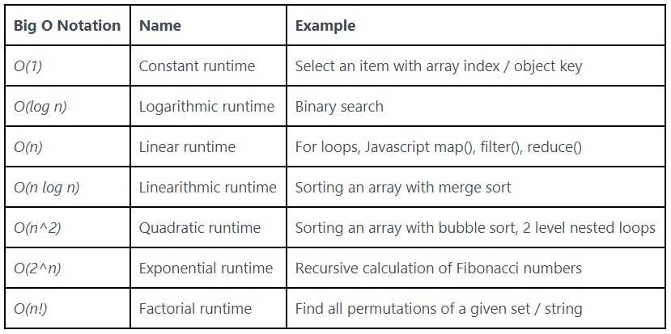
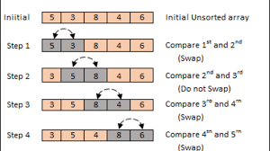
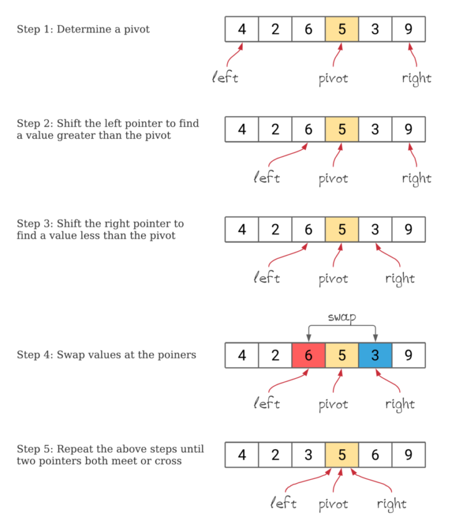

## INDEX

- [INDEX](#index)
- [Algorithm Characteristics](#algorithm-characteristics)
- [common algorithms](#common-algorithms)
- [Measuring algorithm performance](#measuring-algorithm-performance)
- [recursion](#recursion)
- [sorting](#sorting)
  - [sorting routines already built in](#sorting-routines-already-built-in)

---

## Algorithm Characteristics

- complexity
  - space complexity: how much memory
  - time complexity
- inputs/output
- classification
  - serial / parallel, exact / approximate ..

---

## common algorithms

- search
- sorting
- computational : take one set of data and derive another set of data from it.
- collection : counting / filtering ..

---

## Measuring algorithm performance

- we want to do is measure how does the performance of an algorithm change, based on the size of the input set of data.
- **Big-O notation** used to describe algorithm performance. This notation format is used to describe how a particular algorithm performs as the size of the set of input grows over time. And the reason the letter O is used is because the growth rate of an algorithm's time complexity is also referred to as the order of operation.

---

## recursion

when function calls itself from within its own code

- make sure that your recursive function actually terminates and returns at some point. And this is called the breaking condition.
- each time the function is called, remember that the values of the arguments of the previous call are stored aside. They're not written over by the new call. And this is accomplished by the call stack.

---

## sorting

### sorting routines already built in

- Bubble sort 
  - performance of O(n^2) as it is usually for loop in a for loop

---

- merge sort uses recursion 
  - known as a **divide-and-conquer** algorithm

---

- quicksort uses recursion 
  
  
  
  - also known as a **divide-and-conquer** algorithm
  - usually (better than merge sort)
  - opetate in place on data and doesn't need memory
  - worst case O(n^2) when data is already sorted
  - uses **Pivot Point Selection**
  - The main purpose of the partitioning process is to move items that are on the wrong side of the pivot value and figure out the point at which to split the array so we can recursively do this again. So we have two indexes, the lower index and the upper index.
