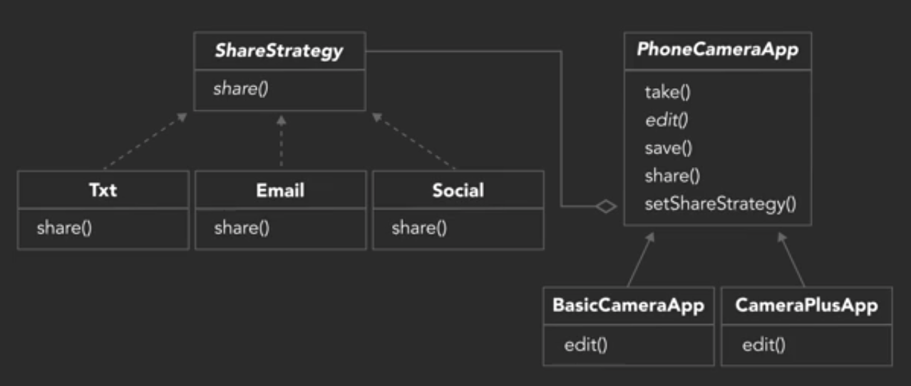
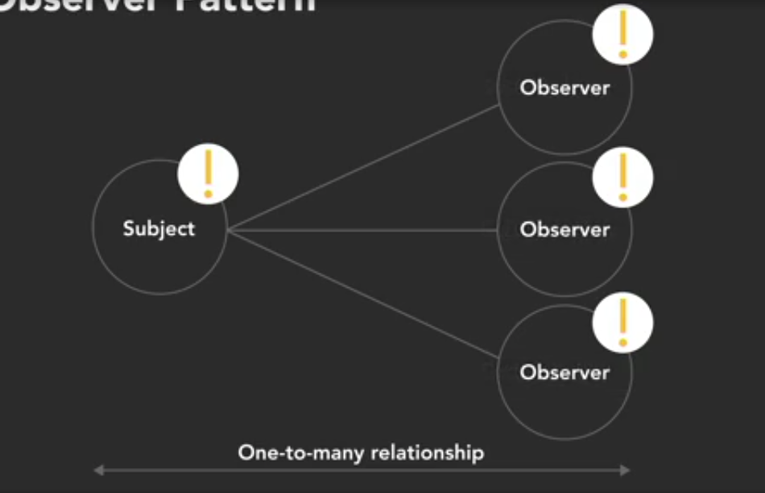

## INDEX

- [INDEX](#index)
- [Design patterns](#design-patterns)
  - [benefits](#benefits)
- [inheritance vs interface](#inheritance-vs-interface)
  - [inheritance](#inheritance)
  - [interfaces](#interfaces)
  - [(encapsulate what varies) principle](#encapsulate-what-varies-principle)
  - [(program to an interface, not an implementation) principle](#program-to-an-interface-not-an-implementation-principle)
  - [notes](#notes)
- [Strategy Pattern](#strategy-pattern)
    - [Class Diagram](#class-diagram)
- [Why HAS-A is better than IS-A](#why-has-a-is-better-than-is-a)
- [Adapter pattern](#adapter-pattern)
- [Observer pattern](#observer-pattern)
    - [Class Diagram](#class-diagram-1)
  - [The Observer pattern and loose coupling](#the-observer-pattern-and-loose-coupling)
- [Decorator pattern](#decorator-pattern)
    - [Class Diagram](#class-diagram-2)
  - [example with coffe shop](#example-with-coffe-shop)
- [Iterator Pattern](#iterator-pattern)
    - [Class Diagram](#class-diagram-3)
- [Factory Pattern](#factory-pattern)
  - [Class Diagram](#class-diagram-4)

---

## Design patterns

- Design patterns provide paths to solutions for some of the most common object-oriented design conundrums.
- They're solutions developed over time through trial and error that are well-documented and can be applied to your specific design problem.
- design pattern expressed by a definition, a `class diagram`, and collected into a catalog of patterns.

### benefits

- help you to not reinvent the wheel
- build resilient to change code

---

## inheritance vs interface

### inheritance

- when you overuse inheritance, you can end up with designs that are inflexible and difficult to change.
- when you start `overriding` methods inherited from superclass, then you should reconsider the design

### interfaces

- interface defines the methods an object must implement in order to be a particular type.
- interfaces allow different classes to share similarities like ducks sharing a fly behavior.
- Interfaces also allow for having two classes that are alike, but don't have the same behavior

- here interfaces fixes the oop proplem but destroys the ability of `code-reuse`

---

### (encapsulate what varies) principle

- This principles says that if some aspect of your code is changing, for instance, say you find yourself altering the flying and quacking code every time you add a new type of duck, well, that's a strong indication that you need to pull out those parts that are changing and to separate them from the rest of your code.
- **How does that help?**
  - Once you separate out the parts that are frequently changing, you can then modify those parts without affecting the rest of your code.
- this principle is fundamental to almost every design pattern

### (program to an interface, not an implementation) principle

- clients remain unaware of specific types of objects they use as long as the objects adhere to the interface that clients expect
- it's like that these changing methods we would specify their type in the `constructor` of each subClass

- all this is an implementation of [Strategy Pattern](#strategy-pattern)

### notes

- `object` is an instance of a `class`
- `concrete instance` refers to any occurrence of objects that exist during the runtime of a computer program.

---

## Strategy Pattern

This pattern defines a family of algorithms, encapsulates each one, and makes them interchangeable.

- This lets the algorithm vary independently from clients that use it.

#### Class Diagram

---

## Why HAS-A is better than IS-A

- when you put two classes together, with `composition`, instead of `inheriting` behavior, an object can then instead delegate that behavior, to the composed object
- favor composition over inheritance from a superclass
  - instead of this:
  - we'll use this: as this will help us as it delegates sharing to the user's preferred share strategy. So this design allows us to more easily add, change, and remove sharing strategies without have to modify any code in the camera app or any code in the concrete camera app classes.

---

## Adapter pattern

- the Adapter Pattern is used to convert the interface of a class into another interface that clients expect. Adapter lets classes work together that couldn't otherwise because of incompatible interfaces. So, this pattern's going to give us a way to have two classes work together when they have incompatible interfaces
  
  
  
- 

---

## Observer pattern

This pattern defines a one-to-many dependency between objects so that when one object changes state, all of its dependents are notified and updated automatically 

#### Class Diagram

### The Observer pattern and loose coupling

- subjects and observers are loosely coupled because, while they interact, which makes them **coupled**, they really don't know a lot about each other, which makes them **loosely coupled**.
  - the subject relies on a list of observers
  - observers can be added, removed or replace at any time
  - subject doesn't care; it keeps doing its job

---

## Decorator pattern

This pattern attaches additional responsibilities to an object dynamically. Decorators provide a flexible alternative to subclassing for extending functionality.

#### Class Diagram

### example with coffe shop

---

## Iterator Pattern

This pattern provides a way to access the elements of an aggregate object(list, set, dict,...) sequentially without exposing its underlying representation.

#### Class Diagram

- Examples in languages:
  - python -> `for/in`
  - Javascript -> `for/of`

---

## Factory Pattern

This pattern defines an interface for creating an object but lets subclasses decide which class to instantiate.

- The Factory pattern encapsulates `object creation logic`, which makes it easy to change later.

### Class Diagram

