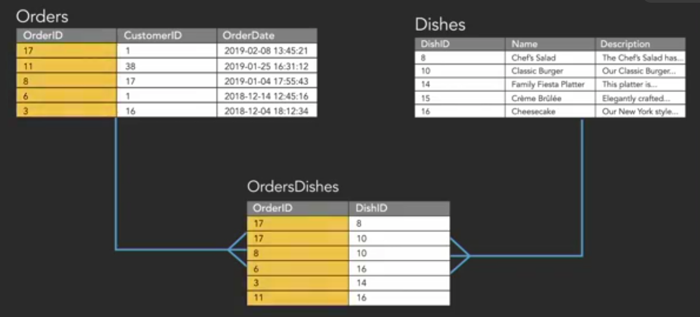
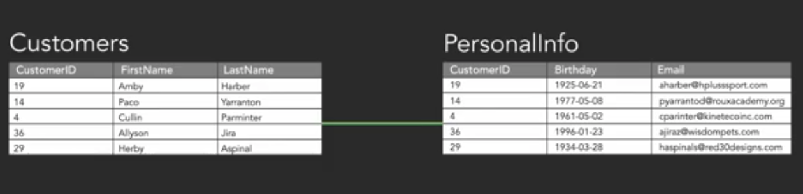

## INDEX

- [INDEX](#index)
- [Databases](#databases)
- [Relational databases](#relational-databases)
  - [Keys and unique values](#keys-and-unique-values)
  - [Relationships](#relationships)
  - [ACID and transactions](#acid-and-transactions)
  - [SQL](#sql)
  - [Relationship rules and referential integrity](#relationship-rules-and-referential-integrity)
- [Database Optimization](#database-optimization)
  - [Normalization Rules](#normalization-rules)
  - [Denormalization](#denormalization)
- [stored procedures](#stored-procedures)
- [Access control, compliance, and injection](#access-control-compliance-and-injection)
- [NOSQL (not only sql)](#nosql-not-only-sql)

---

## Databases

- A database gives us a way to add structure to data and to define rules that the data must follow. The whole point of having data is to be able to use it for something, and a database gives us the tools both to protect data and to use data to answer questions.
- database can contain more than one table and databases offer the ability to create relationships between tables based on rules you define.
- The structure of tables in the database is called the **schema**.
  - The database's schema includes the information about the layout of tables and other information about the database itself.
- the ability to create relationships between tables is a core function of relational databases.

---

## Relational databases

- relational database is made up of relations or tables which are the set of columns, and these tables also contain rows, representing different **instances**. Every column or piece of information about the individual instance will have a type that we define to tell the database what sort of information it contains.
- column data types:
  - number
  - text
  - date
  - true/false
  - binary data

### Keys and unique values

- **unique value** is a value that doesn't show up in any other row in a given column. So there's one and only one of any particular value for that particular field.
- unique values can also be used as keys
- A table doesn't require a **primary key**, but having one helps to access specific records easily.
- **synthetic key or a surrogate key** is when making the value in the new column a number and telling the database to increment the number for every new number that's added >> ex: ID.
- In some situations, we might not be able to modify the schema of the table, and we might need to `use combination of (two or more fields) in the data to act as a key`. This is called a **composite key**.
- **Foreign key** this is what a primary key from one table is called when it's referenced in another table.

### Relationships

- one to many (most popular) 
- many to many (here we use **linking/associated** table) 
- one to one (usually for sequrity) 

### ACID and transactions

- A transaction is a set of operations that must all be completed, and if for some reason any of the individual operations aren't completed, no changes are made to the database. Anything that's partially done will be undone.
- Transactions follow a set of principles outlined by the acronym **ACID**.

### SQL

- SQL allows us to write statements which the DBMS interprets, and that's how we interact with the data in the database, from apps, or even within the DBMS itself. In this role of interacting with data, SQL is called a `data manipulation language`, or **DML**.
- **RDBMS** : relational database management system.
- when we're asking for information from the database or asking for the database to do something, these statements are called **queries**
- [create, read, update, delete] are called **crud**, and they're the basis of interacting with data.

### Relationship rules and referential integrity

- **Referential integrity**
  - means the database will be aware of the relationship and will not let you or another user modify data in a way that violates that relationship
  - it prevents the user from entering a record that refers to `nonexistent` data
  - This helps us to maintain the consistency of the database.

---

## Database Optimization

### Normalization Rules

They help us to reduce `redundancy` and improve the `integrity` of our data.

- first normal form (1NF)
  - requires that values in each cell are atomic, and that tables have no repeating groups.
  - This means that each field in each table has only one value in it, and that there are no columns representing repeated kinds of data for each row (**remove repeating groups**).
  -  
- second normal form (2NF)
  - no value in our table should depend only on part of a key that can be used to uniquely identify a row.
  - This means that for every column in the table that isn't a key, each of the values must rely on only the whole key.
  - The values must describe something about that row that we can't determine from just the part of a key.
- third normal form (3NF)
  - we shouldn't be able to figure out any value in a column from a field that isn't a key.
  - you shouldn't calculate values in a column from values in another column 

### Denormalization

- is the process of **intentionally duplicating** information in tables in violation of normalization rules.
- Denormalization is done after normalizing a database. It doesn't mean skipping normalization altogether.
- it consciously choosing to violate the rules of normality in order to improve speed or for some other business
- when to use it ?
  - Retrieving the data upon request would be slow or burdensome, and you are able to pre-calculate or store a copy of the data somewhere it can be retrieved faster.

---

## stored procedures

- is kind of like a program you write that's stored on the database server. It contains a series of commands that you can then reference and use when you interact with the database.
- Using a stored procedure, you can avoid having to write out a long or detailed query if it's something you use frequently.
- Stored procedures are also used to provide safe or approved ways of dealing with sensitive data. Instead of allowing access to data directly from manually entered SQL, which could contain errors.
- database administrator often provides a set of stored procedures designed to take certain input, run transactions, and verify a result of a query.

---

## Access control, compliance, and injection

- **Access control** includes user accounts and control over whether certain people can access certain tables or even individual columns.
- **SQL injection** type of attack that includes part of a sql command entered as a value to hijack a query and change how it works

---

## NOSQL (not only sql)

- unstructured data
- key-value pairs
- graphs like the Facebook social graph
- objects
- geographic data points
- streams of information, like posts and comments on social media websites.
