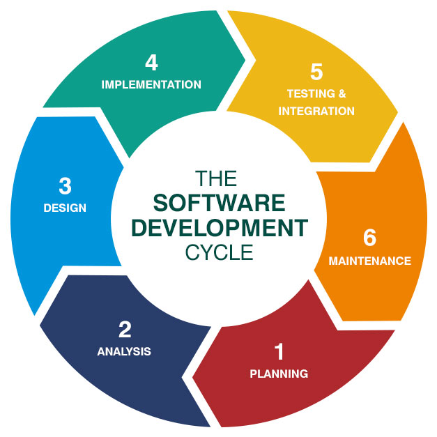

## INDEX

- [INDEX](#index)
- [Quality assurance](#quality-assurance)
  - [SDLC](#sdlc)
- [Testing](#testing)
  - [model testing (like a box)](#model-testing-like-a-box)
  - [manual testing](#manual-testing)
  - [Integration testing](#integration-testing)
  - [Performance testing](#performance-testing)
  - [Sequrity testing](#sequrity-testing)

---

## Quality assurance

QA, is a systematic process used to determine whether a product meets specifications.

### SDLC

---

## Testing

### model testing (like a box)

1. **Black box testing**, which means that the box is completely concealed and it is not possible to see inside of it. Each test scenario here examines the product from the outside. It allows input to the box and gets output from the box. This means that there is no knowledge needed about the internals of the application
   - The focus with black box testing is to perform an action in the user interface and expect a certain result from that action.
   - Black box tests include manual testing and UI automation testing, both of which will help uncover issues with functionality and usability.
2. **Gray box testing**, Here the box is semi-transparent. Test scenarios here examine the interaction between the outside and inside of the box.
   - It requires QA engineers to have a deeper understanding of the application.
   - Gray box tests include integration testing, which examines how components of the application work together.
3. **White box testing**, Here the box is completely transparent and focuses on the internals of the application and what is happening at the code or system level
   - It tests specific functionalities in the code and verifies the result.
   - White box testing includes unit and system testing. Developers are responsible for these type of tests and write them alongside development.

### manual testing

Manual testing follows the steps as a user performing workflows in the application. The goal is to uncover any issues in the functionality and usability. Before performing manual testing know what scenarios you want to cover.

### Integration testing

focuses on the interaction between components at lower layers of the application. This level of testing covers similar scenarios as we've seen with manual and UI automation testing, but doesn't look at what's happening at the UI level as a result. Instead, integration tests see how the system reacts to certain actions.`

- it takes relativaly long time

### Performance testing

- is done to benchmark how a system performs under load. It will help ensure that an application can scale over time and use.
- it's type of **Black box testing**

### Sequrity testing

looks to expose problems in the application that can either cause it to behave in unexpected ways or stop it from working.
