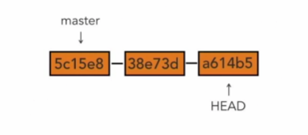
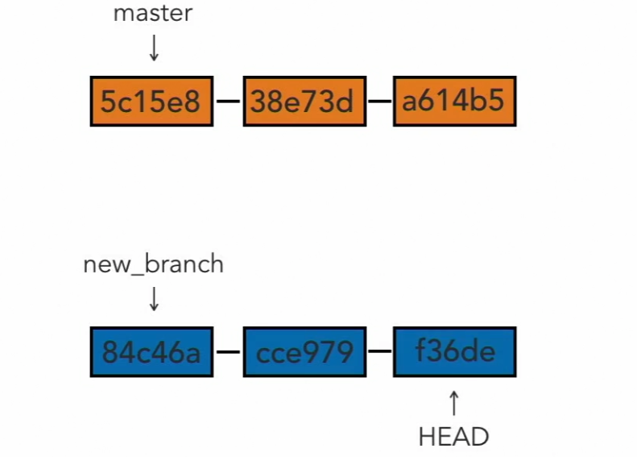
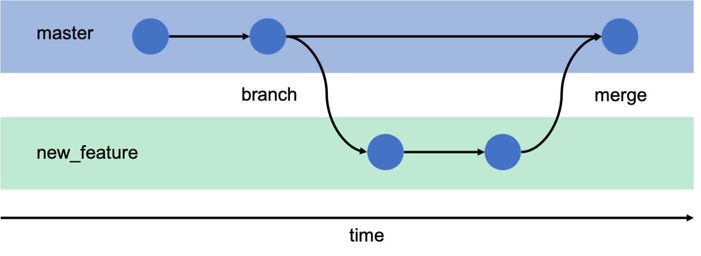
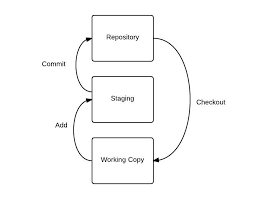
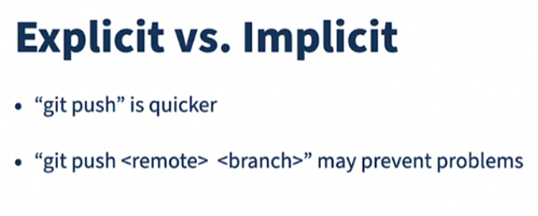

## INDEX

- [INDEX](#index)
- [Git](#git)
  - [advantages of distributed version control](#advantages-of-distributed-version-control)
- [commit message](#commit-message)
  - [Writing a commit message guidelines](#writing-a-commit-message-guidelines)
  - [Hash values (SHA-1)](#hash-values-sha-1)
  - [The HEAD pointer](#the-head-pointer)
  - [going to previous-direct commit (undo changes)](#going-to-previous-direct-commit-undo-changes)
  - [going to any previous commit (undo changes)](#going-to-any-previous-commit-undo-changes)
- [Branches](#branches)
  - [commands](#commands)
  - [notes](#notes)
- [Git Three Trees (Git workflow)](#git-three-trees-git-workflow)
- [Git commands Notes](#git-commands-notes)
  - [Partial add](#partial-add)
- [Ignore files](#ignore-files)
  - [How to Ignore empty directories](#how-to-ignore-empty-directories)
- [Push](#push)
  - [Pushing code explicitly](#pushing-code-explicitly)

---

## Git

Git is software that keeps track of changes that you make to files and directories. And it's especially good at keeping track of text changes.

- Git is referred to as a version control system or **VCS**
- they're also called source code management tools or **SCM**
- Git is **distributed version control**. Different users each maintain their own repositories instead of working from a central repository, and the changes are stored as sets or patches, and we're focused on tracking `changes`, not the versions of the documents.
- Git does not use **small** tracking files throughout a repository -- everything is contained within the .git directory in the top-level directory of the repository.
- Git does not use small tracking files throughout a repository -- everything is contained within the .git directory in the top-level directory of the repository.

### advantages of distributed version control

- no need to communicate with a central server
- faster
- no network access required
- no single failure point as (Everyone can keep working. They've each got their own repository)

---

## commit message

**commit** is a snapshot or checkpoint in your local repo

### Writing a commit message guidelines

- write a short single line summary of what the changes are (less than 50 characters).
- optionally followed by a blank line and a more complete description
- keep each line to less than 72 characters
- write your commit messages in present tense, not past tense, as the commit message is meant to label the changes. It's a label for what's inside.
- clear and descriptive (explain what it does not why/how)
- develop shorthand for your organization ex `"[css,js]"`, `"bugfix"`,`"#38405"` as issue number

### Hash values (SHA-1)

- it's an ID number for each commit
- Each hash value is not only unique, it's directly tied to the contents that are inside of it.
- The algorithm that Git uses is the SHA-1 hash algorithm.

### The HEAD pointer

It's the place where we left off in our repository with what we've committed.




### going to previous-direct commit (undo changes)

```bash
git reset --hard HEAD       # (going back to HEAD)

git reset --hard HEAD^      # (going back to the commit before HEAD)

git reset --hard HEAD~1     # (equivalent to "^")

git reset --hard HEAD~2     # (going back two commits before HEAD)
```

### going to any previous commit (undo changes)

- `-hard` : get rid of the commit **and** the changes done to the files.
- `-soft` :  get rid of the commit **but** not to modify the files in the working directory

```bash
git log
# to quit seeing commits => `Q` key

# then select the id(SHA) you want wo go to
git reset --hard <SHA>

# or
# The last commit will be removed from your Git history.
git reset --soft HEAD~1
```

- going between commits is **dangerous** so we use `branches`

---

## Branches

A branch is a pin pointed arrow to a commit. When you first create a repository, the default branch you will commit too is the master branch.After you make commits, they will point forward on to the last commit you made on that master branch.



### commands

- list available branches

  ```bash
    git branch
  ```

- Leaving the Master Branch

  ```bash
  # create a new branch called : "nathan"
  git branch nathan

  git checkout -b nathan
  #Switched to a new branch "nathan"
  ```

- Merging With Master

  - Once you have committed the changes and pushed to your branch, you can checkout to the master and `merge`.

  ```bash
  git checkout master
  # Switched to branch 'master'
  # then :
  git merge "nathan"
  ```

### notes

- You can't delete a branch that you are currently on, so you have to switch to another branch first.

---

## Git Three Trees (Git workflow)



- **working directory**, which contains changes that may not be tracked by Git yet
  - In the working directory, the user can create new files or change existing files that do not yet exist in either the staging index or the repository, and **no Git command is required to do so**.
- **staging index**, which contains changes that we're about to commit into the repository
- **repository**, and that's what's actually being tracked by Git. The changes that Git has, and that it's going to hold onto and keep track of.

---

## Git commands Notes

- moving a file and **renaming** a file are the same thing. Because moving a file to a new file path, is a way of renaming it So we're actually going to use "move" as the way to rename it. So "git + mv" for short, that's "git + move" and we move the "second_file.txt" to be "secondary_file.txt".
- `git diff` compares the changes to working directory files to the staging index, while `git diff --staged` compares staged files to the repository versions.
- always make atomic commits
- **Compare commits** :

  ```bash
  git diff 1c16945..9dcff6ef6
  # here we tell git not to show me what's in a commit, but compare two different versions, and show me what changed between them
  ```

- Undo working directory changes
  - `git checkout -- <name of file in the working directory that is unstaged>`
- `Amend` means It's taking what's in the last commit, bringing it down, adding your new stuff to it, and recommitting it, and generating a new SHA in the process.
- git add
  - `*` => all items in the folder
  - `.` => remaining items in the folder
- `git show` =>display info about a **one** given commit(most recent one)

### Partial add

```bash
git add --patch <filename> # (or -p for short)
```

---

## Ignore files

- it only applied the rules to **untracked** files, files that are already being tracked are not ignored.

  - to ignore already tracked files:

    ```bash
    # first we remove it from staging area git
    rm --cached <file>
    # then commit the changes
    # Now the ignoring will work
    ```

[This github repo for all recommended casses](<[https://link](https://github.com/github/gitignore)>)

### How to Ignore empty directories

- git by default doesn't track empty directories so we have to put a file in the empty directory >> `.gitkeep`

---

## Push

| GIT Push                                                                                                         | GIT Push origin                                                              |
| ---------------------------------------------------------------------------------------------------------------- | ---------------------------------------------------------------------------- |
| The remote repository is the origin                                                                              | The remote repository is not defined                                         |
| We assume that remote repository is already defined and The work is implicitly pushed into the remote repository | In this, it has to be specified explicitly to be pushed into the repository. |
| only for one repository                                                                                          | It can be used with single as well as multiple repositories                  |

---

### Pushing code explicitly



- when you `push` -> **Always** specify `where` you push

---
