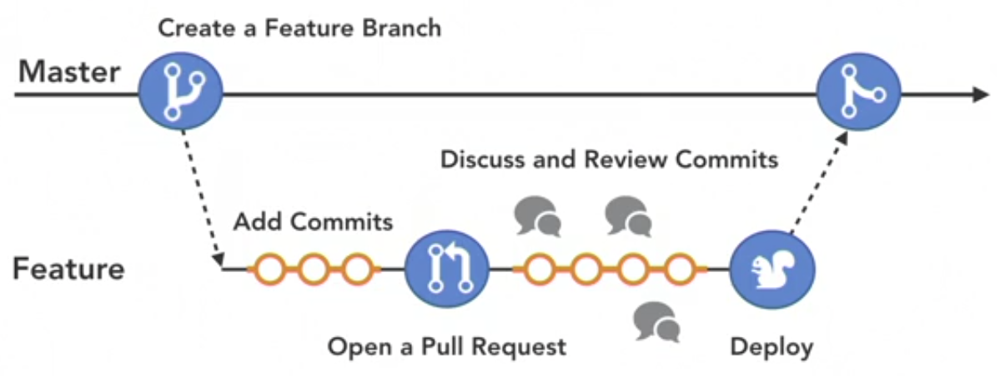
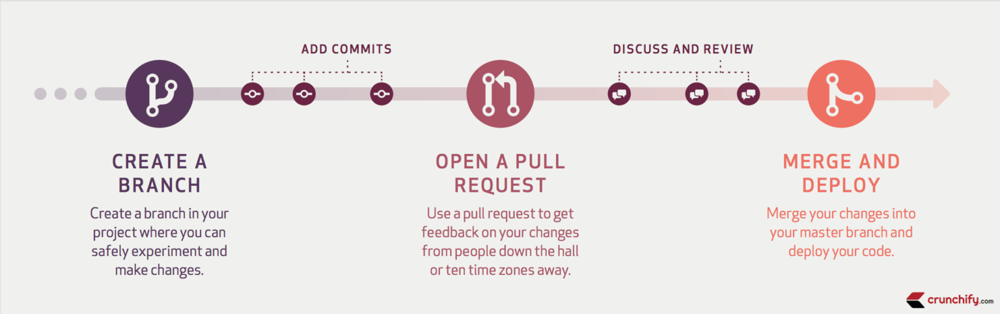

## INDEX

- [INDEX](#index)
- [configuration](#configuration)
- [Github workflow](#github-workflow)
  - [Pull Request](#pull-request)
- [Notes](#notes)

---

## configuration

```bash
git config --global user.name "user"
git config --global user.email "user@example.com"
```

---

## Github workflow



---

### Pull Request



---

## Notes

- `Assign yourself`

  - When you’re assigned to an issue or pull request, it tells repository visitors and contributors that you'll be facilitating the conversation or task

- in `Github desktop` you can select things to commit instead of making all the changes in one commit
  - to do this : `Highlight the lines you want`
